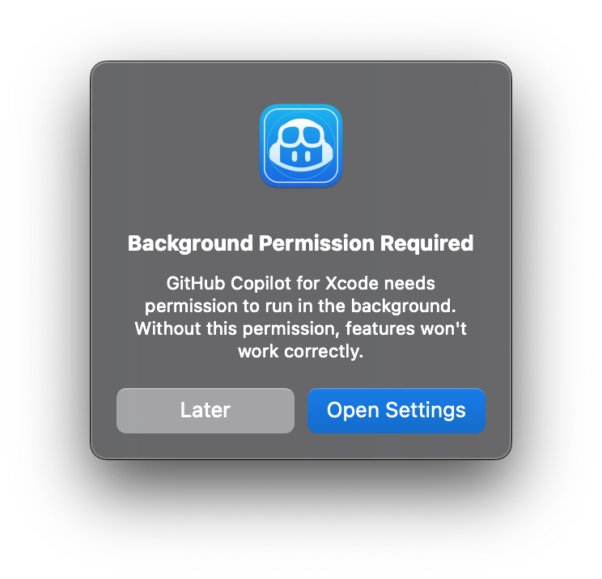
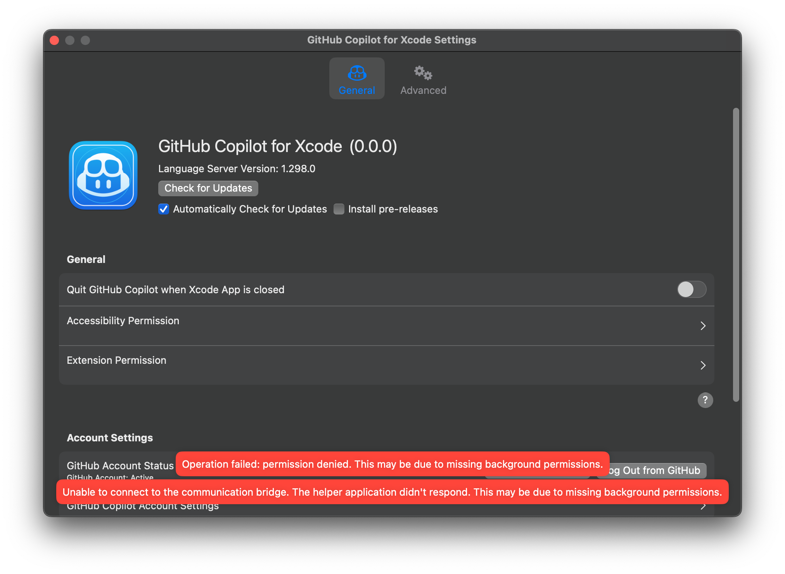

# Troubleshooting for Copilot for Xcode

If you are having trouble with Copilot for Xcode follow these steps to resolve
common issues:

1. Check for updates and restart Xcode. Ensure that Copilot for Xcode has the
   [latest release](https://github.com/github/CopilotForXcode/releases/latest)
   by clicking `Check for Updates` in the settings or under the status menu. After
   updating, restart Xcode.

2. Ensure that all required permissions are granted. GitHub Copilot for Xcode app requires these permissions to function properly:
   - [Extension Permission](#extension-permission) - Allows GitHub Copilot to integrate with Xcode
   - [Accessibility Permission](#accessibility-permission) - Enables real-time code suggestions
   - [Background Permission](#background-permission) - Allows extension to connect with host app

   Please note that GitHub Copilot for Xcode may not work properly if any necessary permissions are missing.

3. Need more help? If these steps don't resolve the issue, please [open an
   issue](https://github.com/github/CopilotForXcode/issues/new/choose). Make
   sure to [include logs](#logs) and any other relevant information.

## Extension Permission

GitHub Copilot for Xcode is an Xcode Source Editor extension and requires the
extension to be enabled. In the Copilot for Xcode settings, clicking `Extension
Permission` will open the System Settings to the Extensions page where `GitHub
Copilot` can be enabled under `Xcode Source Editor`.

Or you can navigate to the permission manually depending on your OS version:

| macOS | Location |
| :--- | :--- |
| 15 | System Settings > General > Login Items > Extensions > Xcode Source Editor |
| 13 & 14 | System Settings > Privacy & Security  > Extensions > Xcode Source Editor |
| 12 | System Preferences > Extensions |

## Accessibility Permission

GitHub Copilot for Xcode requires the accessibility permission to receive
real-time updates from the active Xcode editor. [The XcodeKit
API](https://developer.apple.com/documentation/xcodekit)
enabled by the Xcode Source Editor extension permission only provides
information when manually triggered by the user. In order to generate
suggestions as you type, the accessibility permission is used to read the
Xcode editor content in real-time.

The accessibility permission is also used to accept suggestions when `tab` is
pressed.

The accessibility permission is __not__ used to read or write to any
applications besides Xcode. There are no granular options for the permission,
but you can audit the usage in this repository: search for `CGEvent` and `AX`*.

Enable in System Settings under `Privacy & Security` > `Accessibility` > 
`GitHub Copilot for Xcode Extension` and turn on the toggle.

## Background Permission

GitHub Copilot for Xcode requires background permission to connect with the host app. This permission ensures proper communication between the components of GitHub Copilot for Xcode, which is essential for its functionality in Xcode.


<p align="center">
     
</p>

This permission is typically granted automatically when you first launch GitHub Copilot for Xcode. However, if you encounter connection issues, alerts, or errors as follows:

<p align="center">
     
     
</p>

Please ensure that this permission is enabled. You can manually navigate to the background permission setting based on your macOS version:

| macOS | Location |
| :--- | :--- |
| 15 | System Settings > General > Login Items & Extensions > Allow in the Background |
| 13 & 14 | System Settings > General > Login Items > Allow in the Background |

Ensure that "GitHub Copilot for Xcode" is enabled in the list of allowed background items. Without this permission, the extension may not be able to properly communicate with the host app, which can result in inconsistent behavior or reduced functionality.


## Logs

Logs can be found in `~/Library/Logs/GitHubCopilot/` the most recent log file
is:

```
~/Library/Logs/GitHubCopilot/github-copilot-for-xcode.log
```

To enable verbose logging, open the GitHub Copilot for Xcode settings and enable
`Verbose Logging` in the `Advanced` tab. After enabling verbose logging, restart
Copilot for Xcode for the change to take effect.
